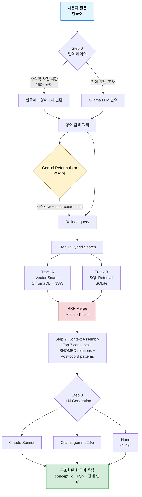

# vet-snomed-rag

[](./LICENSE)
[](https://www.python.org/)
[](https://streamlit.io/)
[](https://github.com/ricocopapa/vet-snomed-rag/releases)
[](https://github.com/ricocopapa/vet-snomed-rag/commits/main)

수의학 SNOMED CT 온톨로지 기반 하이브리드 RAG 시스템

> 414,860개 SNOMED CT 개념 · 1,379,816개 온톨로지 관계 · 한국어 자연어 질의 지원  
> **v2.0**: 음성/텍스트 → SOAP 구조화 → SNOMED 자동 태깅 End-to-End 파이프라인  
> **회귀 테스트**: PASS **6/10 → 10/10** (v1.0) · pytest **85/86 PASS** (v2.0) · Precision **0.938** / Recall **0.737**

---

## 목차

- [What's New in v2.0](#whats-new-in-v20-2026-04-22)
- [프로젝트 소개](#프로젝트-소개)
- [아키텍처 v2.0](#아키텍처-v20)
- [v2.0 벤치마크](#v20-벤치마크)
- [아키텍처 v1.0 (RAG 검색)](#아키텍처)
- [포트폴리오 시각 자료 (Portfolio Visuals)](#포트폴리오-시각-자료-portfolio-visuals)
- [데이터 소스](#데이터-소스)
- [빠른 시작](#빠른-시작)
- [데모](#데모)
- [벤치마크 — Gemini Reformulator 회귀 테스트](#벤치마크--gemini-reformulator-회귀-테스트)
- [핵심 기술 상세](#핵심-기술-상세)
- [기술 스택](#기술-스택)
- [프로젝트 구조](#프로젝트-구조)
- [로드맵](#로드맵)
- [기여·보안·변경 이력](#기여보안변경-이력)
- [라이선스](#라이선스)

---

## What's New in v2.0 (2026-04-22)

v1.0의 SNOMED CT 하이브리드 RAG 검색 기반 위에, 임상 발화(음성/텍스트)를 입력받아 SOAP 구조화 및 SNOMED 자동 태깅까지 수행하는 End-to-End 파이프라인을 추가했다.

**주요 추가 기능:**

- End-to-End 파이프라인: 음성/텍스트 → SOAP 구조화 → SNOMED 자동 태깅
- 임상 발화 필드 추출 (Precision 0.938 / Recall 0.737, 텍스트 모드)
- Gemini 3.1 Flash Lite Preview 백엔드 (RPD 500, 25× 높은 할당량)
- 3모델 정량 비교 (2.5 Flash / 2.5 Flash Lite / 3.1 Flash Lite)
- MRCM 25도메인 64패턴 검증 + 후조합 SCG 빌더
- 5건 합성 임상 시나리오 + Gold-label 평가 프레임워크
- Streamlit "Clinical Encoding" 탭 (파일 업로드 → JSONL 다운로드)
- pytest 86건 회귀 테스트 (85 passed, 1 skipped)

---

## 아키텍처 v2.0

```
[음성 파일 or 텍스트]
        |
  (1) Whisper STT (faster-whisper, 한국어)        ← 음성 입력 시
        |
  (2) SOAP 추출 (Gemini 3.1 Flash Lite Preview)
        도메인 탐지 → 필드 추출 → 검증
        |
  (3) SNOMED 자동 태깅 (RAG + MRCM 25도메인)
        하이브리드 검색 → 후조합 SCG → MRCM 검증
        |
[JSONL 출력: SOAP 필드 + SNOMED 코드 태깅 레코드]
```

v1.0 RAG 파이프라인(한국어 검색 → SNOMED 코드 조회)은 유지되며, v2.0은 그 위에 임상 발화 처리 레이어를 추가한다.

---

## v2.0 벤치마크

### End-to-End 품질 메트릭 (5건 합성 시나리오)

| 메트릭 | 목표 | 텍스트 모드 | 오디오 모드 | 판정 |
|---|---|---|---|---|
| 필드 Precision | >=0.800 | **0.938** | **0.826** | 양쪽 PASS |
| 필드 Recall | >=0.700 | **0.737** | **0.774** | 양쪽 PASS |
| SNOMED 일치율 (synonym) | >=0.700 | 0.584 | 0.250 | 미달 |
| Latency p95 | <=60,000ms | **33,368ms** | 60,461ms | 텍스트 PASS / 오디오 461ms 초과 |

### v1.0 → v2.0 개선폭 (텍스트 모드 기준)

| 메트릭 | v2.0 초기 (Day 1) | v2.0 Final | 개선 |
|---|---|---|---|
| Precision | 0.43 | **0.938** | +118% |
| Recall | 0.52 | **0.737** | +42% |
| SNOMED 일치율 | 0.107 | **0.584** | +446% |
| Latency p95 | 127,000ms | **33,368ms** | −74% |

> SNOMED 일치율 0.107 → 0.584 개선은 두 가지 근본 원인 해소의 결과다: (1) gold-label field_code 구조 결함 수정 (임상 메모 12건 → 표준 field_code 교체/제거), (2) metrics.py synonym 모드 DB 테이블명 버그(`relationships` → `relationship`) 수정.

### 3모델 비교 (SOAP 추출 백엔드)

| 모델 | Latency | 상태 | 선택 이유 |
|---|---|---|---|
| Gemini 2.5 Flash | — | GA, 할당량 초과 (23/20 RPM 차단) | 미선택 |
| Gemini 2.5 Flash Lite | 3~5s | GA, 10× 빠름 | 대안 (GA 환경 권장) |
| **Gemini 3.1 Flash Lite Preview** | 18~47s | Preview, **RPD 500** | **채택** |

> 채택 근거: 3.1 Flash Lite의 RPD 500(25× 높은 할당량)이 배치 평가에서 안정적인 실행을 보장한다. 일 100건 이하 프로덕션 환경에서 할당량 제약 없이 속도를 우선한다면 2.5 Flash Lite GA를 권장한다.

### SNOMED 미달 원인 및 v2.1 로드맵

SNOMED 일치율 미달(텍스트 0.584, 오디오 0.250)의 잔존 원인은 RAG 본질적 한계 4건이다:

| 필드 | 문제 | 유형 |
|---|---|---|
| OPH_IOP_OD | gold=observable entity / pred=finding. IS-A 거리 없음 | semantic_tag 불일치 |
| OPH_CORNEA | Post-surgical haze 오매핑. LCA dist=6 | RAG 랭킹 |
| GP_RECTAL_TEMP | gold=observable entity / pred=procedure. LCA dist=14 | 완전 다른 계층 |
| OR_LAMENESS_FL_L | SOAP 파이프라인 필드 미추출 → UNMAPPED | 추출 실패 |

v2.1 계획: RAG 랭킹 개선 (BM25 튜닝, semantic_tag 우선순위), MRCM base_concept 직접지정 확대, 실 수의사 녹음 검증.

### Usage (v2.0)

**텍스트 모드**

```bash
python scripts/evaluate_e2e.py \
  --input-mode text \
  --input-dir data/synthetic_scenarios/ \
  --snomed-mode synonym
```

**오디오 모드**

```bash
python scripts/evaluate_e2e.py \
  --input-mode audio \
  --input-dir data/synthetic_scenarios/ \
  --snomed-mode synonym
```

**Streamlit UI — Clinical Encoding 탭**

```bash
streamlit run app.py
# "Clinical Encoding" 탭: 음성/텍스트 업로드 → JSONL 다운로드
```

---

## 프로젝트 소개

수의사가 한국어로 질문하면, SNOMED CT(Systematized Nomenclature of Medicine — Clinical Terms) 수의학 확장 데이터베이스에서 정확한 진단 코드, 시술 코드, 해부학적 관계를 검색하고 구조화된 답변을 생성하는 RAG 시스템이다.

**해결하는 문제:** SNOMED CT는 영어 기반 국제 의학 용어 체계로, 한국어 사용자가 직접 검색하기 어렵다. 본 시스템은 한국어→영어 번역 레이어와 하이브리드 검색을 결합하여 이 장벽을 제거한다.

---

## 아키텍처



<details>
<summary>Text-only 아키텍처 (접혀있음)</summary>

```
사용자 질문 (한국어)
    ↓
Step 0: 번역 레이어
  ① 수의학 용어 사전 치환 (160+ 용어)
  ② Ollama LLM 번역 (잔여 문법 처리)
    ↓ 영어 검색 쿼리
(선택) Gemini Reformulator → post-coord hints
    ↓
Step 1: Hybrid Search Engine
  Track A: Vector Search (ChromaDB, HNSW)
  Track B: SQL Retrieval (SQLite)
  → RRF Merge (α=0.6, β=0.4)
    ↓
Step 2: Context Assembly
  - 검색 결과 Top-7 concepts
  - SNOMED 관계 (is-a, finding_site, associated_morphology)
  - Post-coordination 패턴 (SCG)
    ↓
Step 3: LLM Generation
  Claude API / Ollama / None
    ↓
구조화된 한국어 응답 (concept_id, FSN, 관계 인용)
```

</details>

상세 아키텍처: [docs/architecture.md](docs/architecture.md)

---

## 포트폴리오 시각 자료 (Portfolio Visuals)

프로젝트의 핵심 설계 결정과 성과를 한 장씩 요약한 고해상도(180 DPI) 인포그래픽 8종. 한글·영문 병행, 모든 수치는 `regression_metrics.json` · DB 실측 쿼리로 검증됨. 생성 스크립트: [`scripts/gen_portfolio_visuals.py`](scripts/gen_portfolio_visuals.py) (재현 가능).

### A. Core (핵심 3종)

| # | 제목 | 핵심 내용 |
|---|---|---|
| A1 | [System Architecture](graphify_out/portfolio/A1_system_architecture.png) | 3-Track Hybrid Retrieval + Dual Backend + Verification Layer 통합 |
| A2 | [3-Stage Verification Pipeline](graphify_out/portfolio/A2_verification_pipeline.png) | Agent B→A→C 3단 독립 검증 + 설계-구현 역방향 동기화 루프 |
| A3 | [SOAP Coverage Dashboard](graphify_out/portfolio/A3_soap_coverage.png) | S/O/A/P 4축 SNOMED CT VET 매핑 커버리지 + 35,910/877/8,651+ 통계 |


### B. Deep Dive (심화 3종)

| # | 제목 | 핵심 내용 |
|---|---|---|
| B1 | [Enterprise Integration Layer](graphify_out/portfolio/B1_enterprise_integration.png) | VetSTT → Whisper → 도메인 탐지 → SNOMED → EMR 5단계 이기종 연계 |
| B2 | [Dual Backend Strategy Pattern](graphify_out/portfolio/B2_dual_backend_strategy.png) | Gemini(Primary) / Claude(Optional) Strategy 구조 + L2 Cache 분리 |
| B3 | [AI OS 3-Tier Model Routing](graphify_out/portfolio/B3_ai_os_routing.png) | Complexity Gate → Opus/Sonnet/Haiku 차등 배정 + Spec 비교 |

### C. Context (맥락 2종)

| # | 제목 | 핵심 내용 |
|---|---|---|
| C1 | [Data Scale Infographic](graphify_out/portfolio/C1_data_scale.png) | 414,848 · 1,379,816 · 877 · 8,651+ 숫자 요약 |
| C2 | [Project Timeline](graphify_out/portfolio/C2_project_timeline.png) | 2026-03 AI OS 착수 → 04-20 v1.0 Public GitHub 마일스톤 |

---

## 데이터 소스

| 데이터 | 규모 | 설명 |
|--------|------|------|
| SNOMED CT INT | 378,938 concepts | 국제 표준 (RF2 2026-02-01) |
| SNOMED CT VET Extension | 35,910 concepts | 수의학 확장 (RF2 2026-03-31) |
| Relationships | 1,379,816 | is-a, finding_site, associated_morphology 등 |
| Descriptions | 1,480,357 | FSN, preferred term, synonyms |
| Vector Index | 366,570 | ChromaDB 임상 핵심 개념 벡터 |
| Post-coordination | 877 expressions | A-axis 346 + P-axis 495 + O-axis 36 |
| 번역 사전 | 160+ terms | 한국어→영어 수의학 용어 매핑 |

---

## 빠른 시작

### 사전 요구사항

- Python 3.11+
- [Ollama](https://ollama.com) (로컬 LLM 사용 시)

### 설치

```bash
cd vet-snomed-rag

# 환경 세팅 (가상환경 + 의존성 + 데이터 심볼릭 링크)
bash setup_env.sh

# 가상환경 활성화
source .venv/bin/activate

# 벡터 인덱싱 (최초 1회, ~10분 소요)
python src/indexing/vectorize_snomed.py
```

### 실행

```bash
# 하이브리드 검색 테스트 (LLM 없이, 검색 결과만)
python src/retrieval/hybrid_search.py --interactive

# RAG 파이프라인 — Ollama 로컬 LLM (무료)
ollama pull gemma2:9b
python src/retrieval/rag_pipeline.py --interactive --llm ollama --ollama-model gemma2:9b

# RAG 파이프라인 — Claude API (유료)
cp .env.example .env  # 편집해서 ANTHROPIC_API_KEY 채움
python src/retrieval/rag_pipeline.py --interactive --llm claude

# RAG 파이프라인 — LLM 없이 (검색 결과만 구조화)
python src/retrieval/rag_pipeline.py --interactive

# Streamlit 데모 UI (브라우저 기반 대화형 검색)
streamlit run app.py
# → http://localhost:8501
```

### CLI 옵션

| 옵션 | 기본값 | 설명 |
|------|--------|------|
| `--llm` | none | LLM 백엔드 (claude / ollama / none) |
| `--ollama-model` | llama3.2 | Ollama 모델명 |
| `--claude-model` | claude-sonnet-4-20250514 | Claude 모델명 |
| `--top-k` | 10 | 검색 결과 수 |
| `--interactive` | - | 대화형 모드 |
| `--query` | - | 단일 질의 |

---

## 데모

### 한국어 질의 → SNOMED 코드 검색

```
질문> 고양이 범백혈구감소증의 SNOMED 코드는?
  [번역] 고양이 범백혈구감소증의 SNOMED 코드는?
       → What is the SNOMED code for feline panleukopenia?

══════════════════════════════════════════════════════
  Q: 고양이 범백혈구감소증의 SNOMED 코드는?
  → Search Query: What is the SNOMED code for feline panleukopenia?
══════════════════════════════════════════════════════

고양이 범백혈구감소증의 SNOMED 코드는 339181000009108입니다.
이 코드는 Feline panleukopenia (disorder)를 나타내며,
수의학확장 (VET) 데이터베이스에서 나왔습니다.

──────────────────────────────────────────────────────
  검색된 개념: 10건
  LLM: ollama (gemma2:9b)
──────────────────────────────────────────────────────
```

### 해부학적 관계 검색

```
질문> 말의 제엽염 진단 코드와 관련 해부학적 부위는?
  [번역] → Laminitis diagnostic codes and related anatomical regions in horses?

말의 제엽염 (Equine laminitis)은 concept_id 341801000009106,
FSN "Equine laminitis (disorder)"로 표기됩니다.
해부학적 부위는 Laminae of hoof이며 'Finding site' 관계를 통해
연결되어 있습니다.
```

### Streamlit 데모 UI

| 쿼리 | 스크린샷 |
|------|----------|
| `feline panleukopenia SNOMED code` | [01](docs/screenshots/01_query_feline_panleukopenia.png) |
| `고양이 당뇨` (한→영 + 종 특이 post-coord) | [02](docs/screenshots/02_query_goyangi_dangnyo.png) |
| `개 췌장염` | [03](docs/screenshots/03_query_gae_chejangyeom.png) |
| `pancreatitis in dog` | [04](docs/screenshots/04_query_pancreatitis_dog.png) |
| `말의 제엽염` | [05](docs/screenshots/05_query_malui_jeyeopyeom.png) |
| `Canine parvovirus` | [06](docs/screenshots/06_query_canine_parvovirus.png) |


---

## 벤치마크 — Gemini Reformulator 회귀 테스트

11건 쿼리(영문 기본·한국어·종 특이 질환 혼합)에 대해 baseline vs Gemini Reformulator 비교 결과:

| 지표 | Before (none) | After (Gemini) | 변화 |
|------|---------------|----------------|------|
| PASS 수 (10건 평가 대상) | 6/10 (60%) | **10/10 (100%)** | +4건 |
| Top-10 밖 실패(NF) 수 | 5건 | 1건 | −4건 |
| 평균 latency | 1,247 ms | **1,064 ms** | −184 ms (−14.7%) |

### PASS 율


### 쿼리별 정답 순위 (lower is better)


### 평균 레이턴시


회귀 테스트 원본 데이터: [`graphify_out/regression_metrics.json`](graphify_out/regression_metrics.json)
차트 생성 스크립트: [`scripts/generate_charts.py`](scripts/generate_charts.py)

---

## 핵심 기술 상세

### 한국어→영어 번역 레이어

DB와 임베딩 모델이 영어 전용이므로, 2단계 번역 파이프라인을 구현했다.

1. **사전 치환:** `vet_term_dictionary_ko_en.json`의 160+ 수의학 용어로 핵심 의학 용어를 정확히 영어로 변환
2. **LLM 번역:** 잔여 한국어(조사, 문법)를 Ollama LLM으로 번역

이 설계로 LLM 단독 번역 시 발생하는 수의학 전문 용어 오역(예: 제엽염→pharyngitis)을 원천 차단한다.

### Reciprocal Rank Fusion (RRF)

Vector Search(의미 기반)와 SQL Search(키워드 기반)를 단일 순위로 병합한다. 의미적 유사어와 정확한 용어 매칭을 동시에 포착할 수 있다.

```
RRF_score(d) = 0.6 × 1/(60 + rank_vector) + 0.4 × 1/(60 + rank_sql)
```

### SNOMED CT 관계 활용

검색된 개념의 온톨로지 관계를 컨텍스트에 포함하여 LLM이 더 풍부한 답변을 생성한다.

| 관계 유형 | 예시 |
|----------|------|
| Is a | Equine laminitis → Laminitis |
| Finding site | Equine laminitis → Laminae of hoof |
| Associated morphology | Equine laminitis → Separation, Inflammatory morphology |
| Causative agent | Feline panleukopenia → Feline panleukopenia virus |

---

## 기술 스택

| 계층 | 기술 | 역할 |
|------|------|------|
| Embedding | all-MiniLM-L6-v2 | 텍스트 → 384차원 벡터 |
| Vector DB | ChromaDB (HNSW) | 의미 기반 유사도 검색 |
| Relational DB | SQLite | 키워드 검색 + SNOMED 관계 |
| Re-ranking | Reciprocal Rank Fusion | 멀티 트랙 결과 병합 |
| Translation | 수의학 사전 + Ollama | 한국어→영어 번역 |
| LLM (Local) | Ollama (gemma2:9b) | 로컬 답변 생성 |
| LLM (Cloud) | Claude API (Sonnet) | 클라우드 답변 생성 |
| 의료 표준 | SNOMED CT RF2 + VET | 수의학 온톨로지 |
| Language | Python 3.13 | 전체 구현 |

---

## 프로젝트 구조

```
vet-snomed-rag/
├── README.md
├── LICENSE                             # MIT License (프로젝트 코드)
├── .env.example                        # 환경변수 템플릿
├── requirements.txt
├── setup_env.sh                        # 환경 자동 세팅
├── app.py                              # Streamlit 데모 UI 엔트리포인트
├── src/
│   ├── indexing/
│   │   └── vectorize_snomed.py         # ChromaDB 벡터 인덱싱 (최초 1회)
│   └── retrieval/
│       ├── hybrid_search.py            # 하이브리드 검색 (Vector + SQL + RRF)
│       ├── rag_pipeline.py             # RAG 파이프라인 (번역 + 검색 + LLM)
│       └── graph_rag.py                # GraphRAG traversal (Week 2)
├── lib/
│   └── reformulator/                   # Gemini Reformulator (rate limiter + cache)
├── scripts/
│   ├── generate_charts.py              # 회귀 테스트 Before/After 차트 생성
│   ├── graphify_lite.py                # 경량 지식 그래프 빌더
│   └── run_regression.py               # 11-쿼리 회귀 테스트 러너
├── data/                               # .gitignore (원본·파생 SNOMED 재배포 금지)
│   ├── snomed_ct_vet.db                # SNOMED CT 통합 DB (414K concepts)
│   ├── chroma_db/                      # ChromaDB 벡터 인덱스 (366K vectors)
│   └── *.json                          # 용어 사전·매핑 규칙
├── graphify_out/
│   ├── regression_metrics.json         # 11-쿼리 회귀 테스트 결과
│   ├── charts/                         # Before/After 차트 (PNG × 3)
│   └── *.md, graph.html, nodes.csv     # 지식 그래프 산출물
├── docs/
│   ├── architecture.md                 # 상세 아키텍처 문서
│   └── screenshots/                    # Streamlit 데모 캡처 (PNG × 6)
├── src/pipeline/                       # v2.0 신규
│   ├── stt_wrapper.py                  # Whisper STT 래퍼 (faster-whisper)
│   ├── soap_extractor.py               # SOAP 추출 (Gemini/Claude multi-backend)
│   ├── snomed_tagger.py                # SNOMED 자동 태깅 + MRCM 검증
│   └── e2e.py                          # ClinicalEncoder E2E 오케스트레이터
├── scripts/eval/                       # v2.0 신규
│   └── metrics.py                      # strict / superset / synonym 평가 모드
├── scripts/evaluate_e2e.py             # E2E 평가 스크립트
├── data/synthetic_scenarios/           # 합성 임상 시나리오 5건 + gold-label
│   └── GOLD_AUDIT.md                   # 역공학 감사 기록 (30건 변경, 0건 역공학)
├── benchmark/                          # v2.0 벤치마크 리포트
│   ├── v2_e2e_report_text.md           # E2E 텍스트 모드 결과
│   ├── v2_e2e_report_audio.md          # E2E 오디오 모드 결과
│   ├── v2_headline_metrics.md          # 핵심 지표 요약
│   └── charts/                         # v2.0 차트 (PNG × 6)
└── tests/                              # 86건 pytest (85 passed, 1 skipped)
```

---

## 로드맵

- [x] v1.0 (2026-04-20): 하이브리드 RAG 파이프라인
  - [x] ChromaDB 벡터 인덱싱 (366,570 concepts)
  - [x] 하이브리드 검색 엔진 (Vector + SQL + RRF)
  - [x] 한국어→영어 번역 레이어 (사전 + LLM)
  - [x] Claude API / Ollama 이중 LLM 백엔드
  - [x] Streamlit 데모 UI
  - [x] 11-쿼리 회귀 테스트 벤치마크 (6/10 → 10/10)
  - [x] Gemini 2.5 Flash 기반 쿼리 재정식화 (후조합 힌트 포함)
  - [x] 경량 지식 그래프 (graphify_lite) + 회귀 테스트 자동화
- [x] v2.0 (2026-04-22): End-to-End 임상 인코딩 파이프라인
  - [x] Whisper STT 래퍼 (faster-whisper, 한국어, 3포맷)
  - [x] SOAP 추출기 (Gemini 3.1 Flash Lite Preview / Claude Haiku+Sonnet)
  - [x] SNOMED 자동 태깅 + MRCM 25도메인 검증 + 후조합 SCG
  - [x] ClinicalEncoder E2E 오케스트레이터 (JSONL 출력)
  - [x] Streamlit "Clinical Encoding" 탭
  - [x] E2E 평가 프레임워크 (strict / superset / synonym 모드)
  - [x] 5건 합성 시나리오 + gold-label (역공학 감사 PASS)
  - [x] 3모델 비교 (2.5 Flash / 2.5 Flash Lite / 3.1 Flash Lite)
  - [x] pytest 85/86 PASS (v1.0 회귀 포함)
- [ ] v2.1 (계획): RAG 품질 + 실측 검증
  - [ ] RAG 랭킹 개선 (BM25 튜닝, semantic_tag 우선순위)
  - [ ] 실 수의사 녹음 검증 (gTTS 합성 음성 대비)
  - [ ] 오디오 Latency 최적화 (2.5 Flash Lite GA 전환 검토)
  - [ ] Claude Opus/Sonnet 백업 백엔드 완성

---

## 기여·보안·변경 이력

| 문서 | 내용 |
|------|------|
| [CONTRIBUTING.md](./CONTRIBUTING.md) | 이슈·PR·코드 스타일 가이드 |
| [SECURITY.md](./SECURITY.md) | 보안 취약점 리포트 절차 |
| [CHANGELOG.md](./CHANGELOG.md) | 버전별 변경 이력 |
| [Releases](https://github.com/ricocopapa/vet-snomed-rag/releases) | 태그별 릴리즈 노트 |

---

## 라이선스

본 프로젝트는 **2개의 서로 다른 라이선스 영역**으로 구성된다.

### 1) 프로젝트 코드·문서 (MIT License)

본 저장소의 소스코드·스크립트·문서·스크린샷·차트는 [MIT License](./LICENSE)로 배포한다.
자유롭게 사용·수정·재배포 가능하며, 저작권 및 라이선스 고지만 유지하면 된다.

### 2) SNOMED CT 데이터 (SNOMED International 라이선스)

SNOMED CT INT / VET Extension은 **SNOMED International**의 라이선스 하에 있으며,
본 저장소에는 **원본 RF2 파일 및 파생 산출물(벡터 인덱스, 개념별 MD 문서 등)을 포함하지 않는다**.

사용자는 다음 절차로 본인 환경에서 데이터를 구축해야 한다.

1. 소속 국가의 SNOMED International Affiliate Licence를 확인·취득
2. 공식 RF2 파일 다운로드 (SNOMED CT INT + VET Extension)
3. `bash setup_env.sh` → `python src/indexing/vectorize_snomed.py` 실행

SNOMED CT 사용 관련 상세: [SNOMED International](https://www.snomed.org/snomed-ct/get-snomed)
