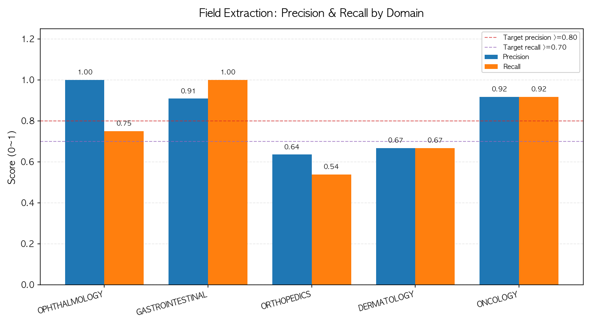
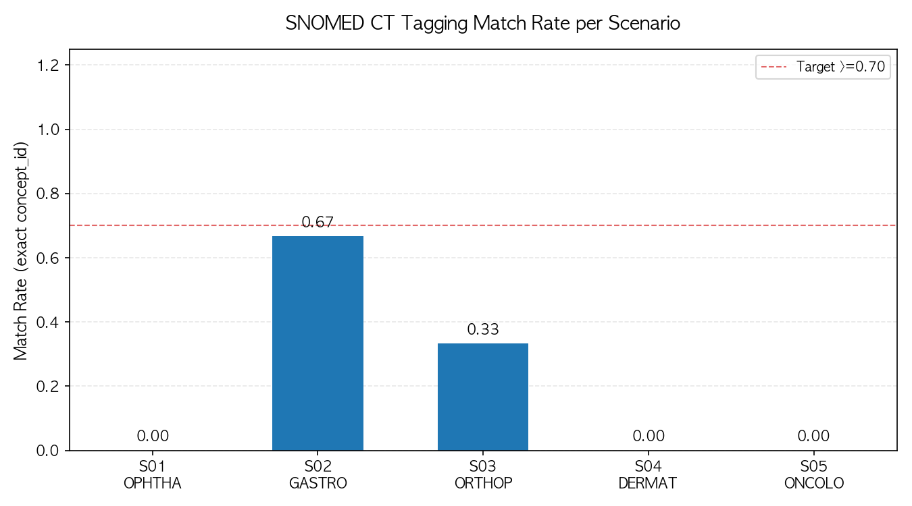
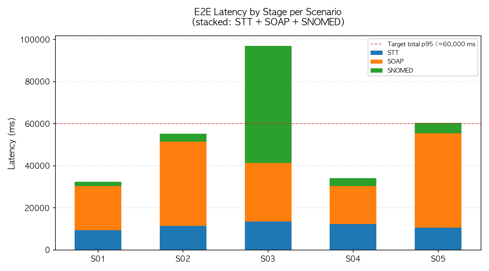

# v2.0 E2E 평가 리포트

> **생성 시각**: 2026-04-22 05:33 UTC  
> **실행 모드**: dry_run (텍스트 입력)  
> **SNOMED 일치 모드**: exact  
> **주의**: dry_run 수치이므로 Day 6 재실행 전까지 공식 수치 아님

---

## §1 Executive Summary

| 메트릭 | 목표 (§5.2) | 결과 | 상태 |
|---|---|---|---|
| SOAP 필드 Precision | >=0.800 | 0.800 | PASS (0.800 >= 0.8) |
| SOAP 필드 Recall | >=0.700 | 0.481 | FAIL (0.481 >= 0.7) |
| SNOMED 태깅 일치율 (exact) | >=0.700 | 0.090 | FAIL (0.090 >= 0.7) |
| E2E Latency p95 | <=60,000 ms | 2349 ms | PASS (2348.900 <= 60000) |

---

## §2 시나리오별 상세 결과

| Scenario | Domain | Precision | Recall | F1 | TP | FP | FN | SNOMED Rate | Total Latency |
|---|---|---|---|---|---|---|---|---|---|
| S01 | OPHTHALMOLOGY | 1.000 | 0.714 | 0.833 | 5 | 0 | 2 | 0.000 | 1813 ms |
| S02 | GASTROINTESTINAL | 1.000 | 0.625 | 0.769 | 5 | 0 | 3 | 0.200 | 19951 ms |
| S03 | ORTHOPEDICS | 0.000 | 0.000 | 0.000 | 0 | 3 | 5 | 0.000 | 1148 ms |
| S04 | DERMATOLOGY | 1.000 | 0.667 | 0.800 | 4 | 0 | 2 | 0.250 | 2349 ms |
| S05 | ONCOLOGY | 1.000 | 0.400 | 0.571 | 2 | 0 | 3 | 0.000 | 838 ms |

---

## §3 메트릭 요약 (Target vs Actual)

### 필드 추출

| 항목 | 수치 |
|---|---|
| Precision (mean) | 0.800 |
| Recall (mean) | 0.481 |
| F1 (mean) | 0.595 |
| 총 TP | 16 |
| 총 FP | 3 |
| 총 FN | 15 |

### SNOMED 태깅 (exact 모드)

| 항목 | 수치 |
|---|---|
| 일치율 (mean) | 0.090 |

### Latency

| 시나리오 | STT p50 | SOAP p50 | SNOMED p50 | Total p50 | Total p95 |
|---|---|---|---|---|---|
| S01 | 0 ms | 0 ms | 1812 ms | 1813 ms | 1813 ms |
| S02 | 0 ms | 0 ms | 19951 ms | 19951 ms | 19951 ms |
| S03 | 0 ms | 0 ms | 1148 ms | 1148 ms | 1148 ms |
| S04 | 0 ms | 0 ms | 2349 ms | 2349 ms | 2349 ms |
| S05 | 0 ms | 0 ms | 838 ms | 838 ms | 838 ms |

---

## §4 차트

### Chart 1: 도메인별 필드 Precision/Recall



### Chart 2: SNOMED 태깅 일치율



### Chart 3: E2E Latency (단계별)



---

## §5 Raw JSONL 출력 경로

```
/Users/wondongmin/claude-cowork/07_Projects/vet-snomed-rag/benchmark/v2_e2e_raw.jsonl
```

---

> 본 리포트는 정량 수치만 포함합니다. 임상적 판단은 포함하지 않습니다.
> (data-analyzer 원칙 준수)