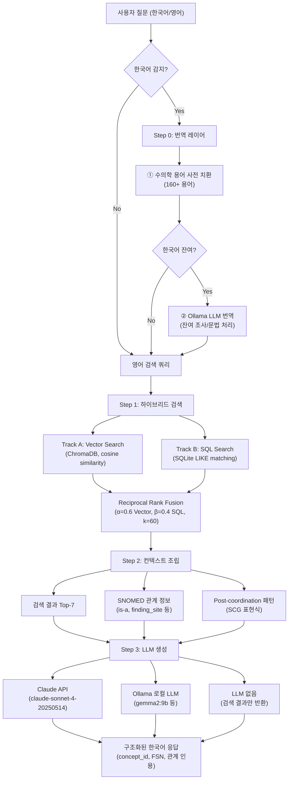
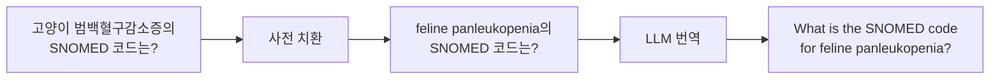
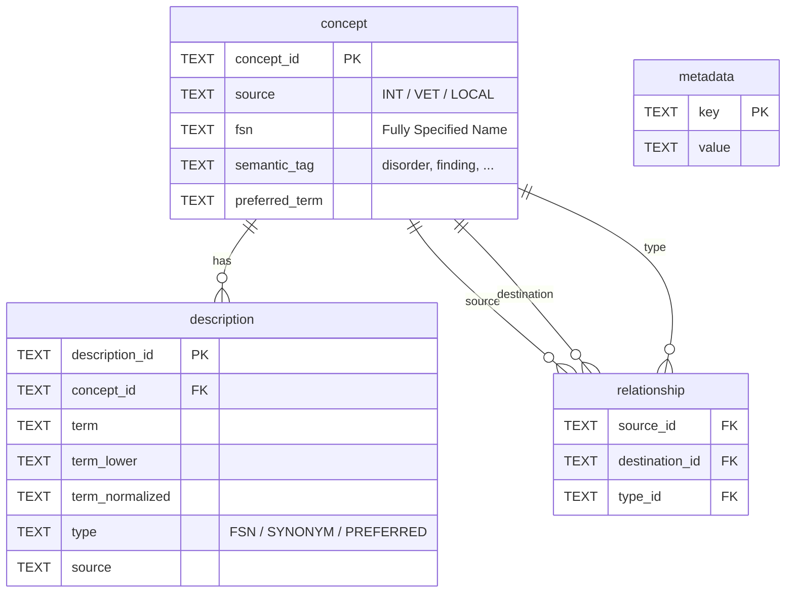

# SNOMED VET RAG — 시스템 아키텍처

> 수의학 SNOMED CT 온톨로지 기반 하이브리드 RAG 시스템의 전체 아키텍처를 기술한다.

---

## 1. 시스템 개요

SNOMED CT VET(수의학 확장) 데이터를 대상으로, 한국어 자연어 질의에서 정확한 의학 코드와 관계 정보를 반환하는 Retrieval-Augmented Generation 시스템이다.

**핵심 특징:**
- 414,860개 SNOMED CT 개념 (INT 378,938 + VET 35,910 + LOCAL 12)
- 366,570개 벡터 인덱스 (임상 핵심 개념)
- 1,379,816개 온톨로지 관계 (is-a, finding_site, associated_morphology 등)
- 한국어→영어 2단계 번역 레이어 (사전 치환 + LLM)
- Claude API / Ollama 로컬 LLM 이중 백엔드

---

## 2. 전체 파이프라인 흐름



---

## 3. 한국어→영어 번역 레이어

DB와 임베딩 모델이 영어 전용이므로, 한국어 질의를 영어로 변환하는 2단계 파이프라인을 구현했다.



### 3.1 사전 치환 (Step 1)

`data/vet_term_dictionary_ko_en.json`에 정의된 160+ 수의학 용어를 문자열 치환한다.

| 카테고리 | 용어 수 | 예시 |
|---------|--------|------|
| 종(Species) | 15 | 고양이→feline, 개→canine, 말→equine |
| 질병(Disorder) | 90+ | 제엽염→laminitis, 범백혈구감소증→panleukopenia |
| 시술(Procedure) | 19 | 중성화 수술→neutering, 예방접종→vaccination |
| 해부학(Body Structure) | 25 | 팔꿈치→elbow, 발굽→hoof, 각막→cornea |
| 병원체(Organism) | 11 | 파보바이러스→parvovirus |

**설계 원칙:** 긴 용어부터 치환하여 부분 매칭 충돌을 방지한다 (예: "고관절 이형성증"이 "이형성증"보다 먼저 치환).

### 3.2 LLM 번역 (Step 2)

사전 치환 후에도 한국어가 남아 있으면 (조사, 문법 요소 등) Ollama LLM으로 나머지를 영어로 번역한다. 사전으로 핵심 의학 용어가 이미 영어로 치환되어 있으므로, LLM은 문법 변환만 담당하여 오역 위험이 최소화된다.

### 3.3 번역 실패 시 폴백

| 상황 | 동작 |
|------|------|
| 사전 치환으로 한국어 완전 제거 | LLM 번역 스킵, 사전 결과 직접 반환 |
| LLM 번역 성공 | LLM 번역 결과 반환 |
| LLM 번역 실패 (타임아웃 등) | 사전 치환 결과라도 반환 |
| 영어 질의 입력 | 번역 없이 원문 그대로 검색 |

---

## 4. 하이브리드 검색 엔진

### 4.1 Track A: Vector Search (의미 기반)

```
Query → all-MiniLM-L6-v2 Embedding → ChromaDB HNSW Index → Top-K (cosine)
```

| 항목 | 값 |
|------|-----|
| 임베딩 모델 | sentence-transformers/all-MiniLM-L6-v2 |
| 벡터 차원 | 384 |
| 인덱스 알고리즘 | HNSW (Hierarchical Navigable Small World) |
| 유사도 메트릭 | Cosine Similarity |
| 인덱싱 건수 | 366,570 concepts |
| 문서 포맷 | `preferred_term \| FSN \| Category: semantic_tag` |

**인덱싱 대상 (13개 priority semantic_tag):**
disorder, finding, procedure, body structure, organism, substance, medicinal product, physical object, qualifier value, observable entity, specimen, morphologic abnormality, animal life circumstance

### 4.2 Track B: SQL Search (키워드 기반)

```
Query → 키워드 추출 → SQLite description 테이블 LIKE 매칭 → 정확 매칭 결과
```

| 항목 | 값 |
|------|-----|
| 검색 대상 | description.term_lower (1,480,357건) |
| 매칭 방식 | LIKE '%keyword%' (부분 매칭) |
| 정렬 | 완전 일치 → 접두어 일치 → 부분 일치 |

### 4.3 결과 병합: Reciprocal Rank Fusion (RRF)

두 트랙의 결과를 단일 순위로 병합한다.

```
RRF_score(d) = α × 1/(k + rank_vector(d)) + β × 1/(k + rank_sql(d))
```

| 파라미터 | 기본값 | 설명 |
|---------|--------|------|
| α (vector_weight) | 0.6 | 벡터 검색 가중치 |
| β (sql_weight) | 0.4 | SQL 검색 가중치 |
| k | 60 | RRF 상수 (순위 차이 완화) |

---

## 5. 데이터 스키마

### 5.1 SQLite DB (snomed_ct_vet.db)



### 5.2 데이터 규모

| 테이블 | 건수 | 설명 |
|--------|------|------|
| concept | 414,860 | INT 378,938 + VET 35,910 + LOCAL 12 |
| description | 1,480,357 | FSN + 동의어 + 선호 용어 |
| relationship | 1,379,816 | is-a, finding_site, associated_morphology 등 |

### 5.3 ChromaDB (Vector Index)

| 항목 | 값 |
|------|-----|
| 컬렉션명 | snomed_vet_concepts |
| 인덱싱 건수 | 366,570 |
| 임베딩 모델 | all-MiniLM-L6-v2 |
| 유사도 공간 | cosine |
| 저장 위치 | data/chroma_db/ |

---

## 6. LLM 백엔드

### 6.1 Ollama (로컬, 비용 무료)

| 항목 | 값 |
|------|-----|
| 엔드포인트 | http://localhost:11434/api/generate |
| 추천 모델 | gemma2:9b (한국어 안정적) |
| 생성 옵션 | temperature=0.3, repeat_penalty=1.3, num_predict=1024 |
| 응답 후처리 | 특수 토큰 제거, 중국어 필터, 메타 코멘트 제거 |

### 6.2 Claude API (클라우드, 유료)

| 항목 | 값 |
|------|-----|
| SDK | anthropic (공식) |
| 기본 모델 | claude-sonnet-4-20250514 |
| max_tokens | 2048 |
| 인증 | ANTHROPIC_API_KEY 환경변수 |

### 6.3 모델 선택 가이드

| 시나리오 | 추천 | 이유 |
|---------|------|------|
| 로컬 개발/테스트 | Ollama (gemma2:9b) | 무료, M2 Pro 32GB에서 쾌적 |
| 프로덕션/고품질 | Claude API | 최고 품질, 한국어 완벽 |
| 검색만 필요 | --llm none | LLM 비용 없이 검색 결과만 |

---

## 7. 프로젝트 구조

```
vet-snomed-rag/
├── src/
│   ├── indexing/
│   │   └── vectorize_snomed.py       # ChromaDB 벡터 인덱싱 (최초 1회)
│   └── retrieval/
│       ├── hybrid_search.py          # 하이브리드 검색 엔진 (Vector + SQL + RRF)
│       └── rag_pipeline.py           # RAG 파이프라인 (번역 + 검색 + LLM 생성)
├── data/
│   ├── snomed_ct_vet.db              # SNOMED CT 통합 DB (414K concepts)
│   ├── chroma_db/                    # ChromaDB 벡터 인덱스 (366K vectors)
│   ├── vet_term_dictionary_ko_en.json # 한국어→영어 수의학 용어 사전
│   ├── snomed_post_coord_rules.json  # Post-coordination 규칙 (877건)
│   ├── assessment_snomed_mapping.json # Assessment SOAP 매핑
│   └── plan_snomed_mapping.json      # Plan SOAP 매핑
├── docs/
│   └── architecture.md               # 본 문서
├── requirements.txt
├── setup_env.sh
└── README.md
```

---

## 8. 기술 스택

| 계층 | 기술 | 역할 |
|------|------|------|
| Embedding | sentence-transformers/all-MiniLM-L6-v2 | 텍스트 → 384차원 벡터 |
| Vector DB | ChromaDB (HNSW) | 의미 기반 유사도 검색 |
| Relational DB | SQLite | 키워드 검색 + SNOMED 관계 저장 |
| Re-ranking | Reciprocal Rank Fusion (RRF) | 멀티 트랙 결과 병합 |
| Translation | 수의학 용어 사전 + Ollama LLM | 한국어→영어 질의 번역 |
| LLM (Local) | Ollama (gemma2:9b) | 로컬 답변 생성 |
| LLM (Cloud) | Claude API (Sonnet) | 클라우드 답변 생성 |
| 의료 표준 | SNOMED CT (RF2) + VET Extension | 수의학 온톨로지 |
| Language | Python 3.13 | 전체 구현 |

---

## 9. 설계 결정 및 트레이드오프

### 9.1 왜 하이브리드 검색인가?

| 방식 | 장점 | 한계 |
|------|------|------|
| Vector Only | 의미적 유사어 검색 가능 | concept_id 정확 매칭 불가 |
| SQL Only | 정확한 용어 매칭 | 동의어/유사 개념 누락 |
| **Hybrid (RRF)** | **두 장점 결합** | 가중치 튜닝 필요 |

### 9.2 왜 번역 레이어에 사전을 선행하는가?

LLM 단독 번역 시 수의학 전문 용어 오역이 빈번했다 (예: 제엽염→pharyngitis). 사전으로 핵심 용어를 먼저 치환하면 LLM은 조사/문법만 처리하므로 오역이 원천 차단된다.

### 9.3 왜 all-MiniLM-L6-v2인가?

| 모델 | 차원 | 속도 | 한국어 | 선택 이유 |
|------|------|------|--------|---------|
| all-MiniLM-L6-v2 | 384 | 빠름 | 미지원 | 영어 DB 전용, 인덱싱 속도 우선 |
| multilingual-e5-base | 768 | 보통 | 지원 | 한국어 직접 검색 시 대안 |

현재는 번역 레이어로 한국어 처리를 분리했으므로, 경량 영어 전용 모델이 적합하다. 향후 한국어 동의어가 DB에 추가되면 멀티링구얼 모델로 교체를 검토한다.
